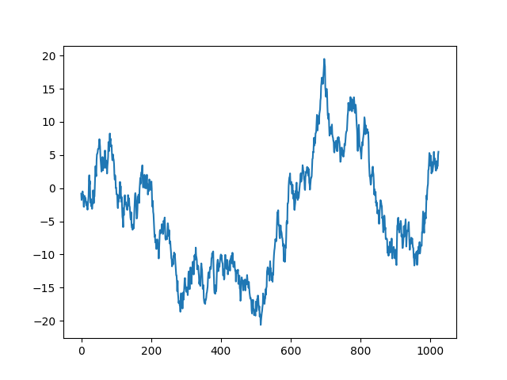
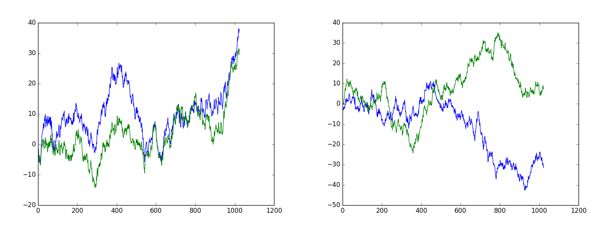
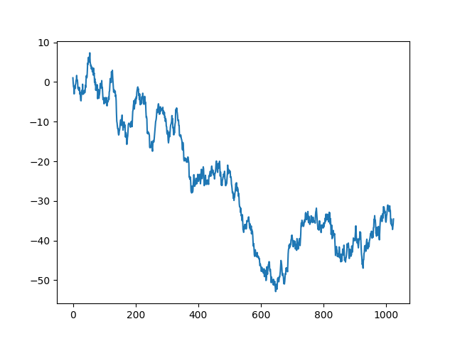

# Using CNN on 2D Images of Time Series
Because too often time series are fed as 1-D vectors Recurrent Neural Networks (Simple RNN, LSTM, GRU..).

<p align="center">
  <b>Will this time series go up or down in the next time frame?</b><br>
  
  <b>Which plot contains highly correlated time series?</b><br>
  
</p>

## Possible advantages/drawbacks of such approach:

### Advantages
- Almost no pre-processing. Feed raw pixels (be careful of the resolution of the image though)!
- We can add several time series on the same plot or on a different plot and concatenate both images.
- Conv Nets have the reputation of being more stable than Recurrent Neural Networks for many tasks (WaveNet is just one example).
- No vanishing/exploding gradient! Even though, it's less true with LSTM.

### Drawbacks
- Input is much bigger than feeding 1-D vectors. Actually it's very very sparse!
- Training will be undoubtedly slower.
- Sometimes it's also hard to train very big conv nets (VGG19 is such an example).


## Let's get started!

### Fake data generation
```
git clone https://github.com/philipperemy/tensorflow-cnn-time-series.git
cd tensorflow-cnn-time-series/
sudo pip3 install -r requirements.txt
python3 generate_data.py
```

### Start the training of the CNN (AlexNet is used here)
```
python3 alexnet_run.py
```

### Toy example: Binary classification of images of time series

We consider the following binary classification problem of time series:
- *UP*: If the time series went up in the next time frame.
- *DOWN*: if the time series went down.

Because it's impossible to classify pure random time series into two distinct classes, we expect a 50% accuracy on the testing set and the model to overfit on the training set. Here are some examples that we feed to the conv net:

<div align="center">
  <br><br>
</div>

<div align="center">
  <br><br>
</div>

### Output example
```
[TRAINING] #batch = 198, tr_loss = 0.074
[TRAINING] #batch = 199, tr_loss = 0.229
[TRAINING] #batch = 200, tr_loss = 0.075
[TESTING] #batch = 200, te_loss = 0.094, te_acc = 0.992
[ALL] total batches = 200 total mean accuracy on testing set = 0.99
```
